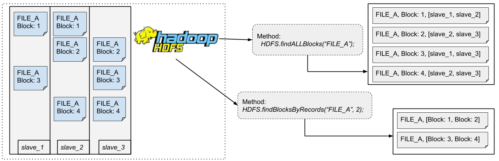

# Integration: COMPSs and HDFS
----------------------

In order to COMPSs be able to access the HDFS's data, it has been developed an integration between COMPSs and HDFS that consists on a HDFS connector.

The idea of this API is to use a file in the HDFS as a commom file. You can read the entire file from HDFS and then split it or you can read the same file in the HDFS already splitted. The second way is more elegant and the number of fragmentations of the file (number of splits) can be choosed. There are two options about the number of fragmentations: the first one is retrieve the natural number of logical blocks (it means, the same fragmentation adopted by HDFS to store the data), using the command *findALLBlocks(filename)* and the second way is to retrieve the blocks by forcing a number of split, using the command *findBlocksByRecords(filename,number)*.
 

Such integration is available for COMPSs applications in [Java](./Java) and [Python](./Python). Support for C/C++ language can be developed later using the same technologies in the Python version.

